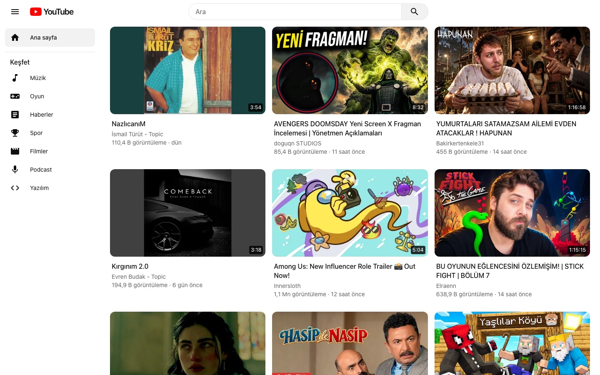
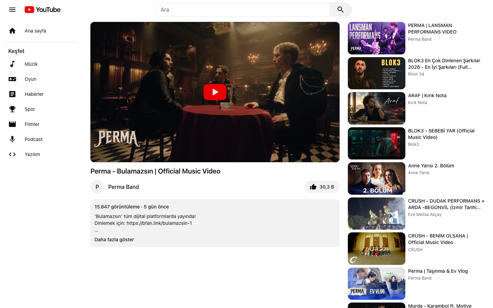
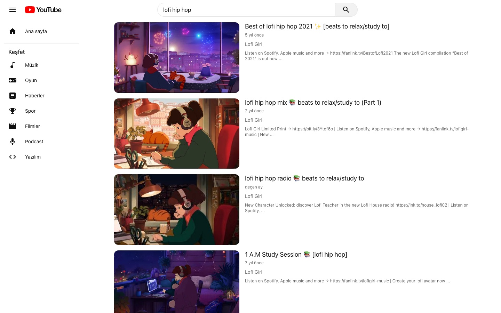

# YouTube Clone

React, TypeScript ve Tailwind CSS ile geliştirilmiş YouTube arayüzü.



| İzleme                                        | Arama                                           |
| --------------------------------------------- | ----------------------------------------------- |
|  |  |

## Özellikler

- Popüler videolar ve sonsuz kaydırma
- Video arama ve kategori kısayolları
- İzleme sayfası ve ilgili videolar
- Koyu tema ve mobil uyumlu arayüz

## Teknolojiler

React 19, TypeScript, Tailwind CSS v4, Redux Toolkit (RTK Query), React Router, Vite, Vitest

## Kurulum

```bash
npm install
cp .env.example .env
npm run dev
```

`.env` dosyasına [RapidAPI YouTube v3](https://rapidapi.com/ytdlfree/api/youtube-v31) anahtarınızı ekleyin.
